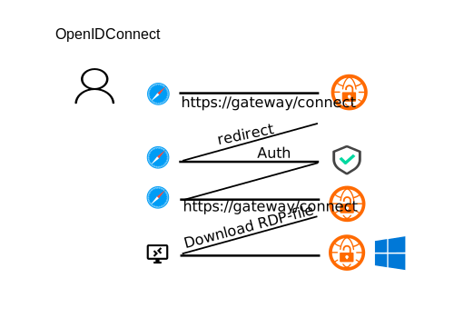
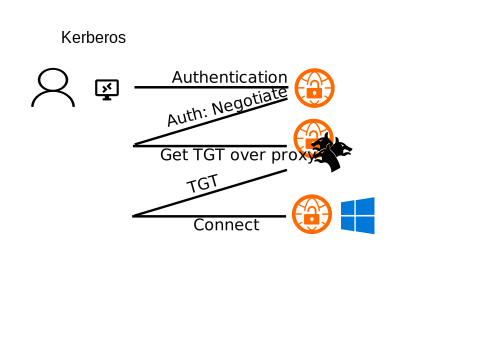

GO Remote Desktop Gateway
=========================


[](https://hub.docker.com/r/bolkedebruin/rdpgw/)
[](https://hub.docker.com/r/bolkedebruin/rdpgw/)
[](https://hub.docker.com/r/bolkedebruin/rdpgw/)


:star: Star us on GitHub — it helps!

RDPGW is an implementation of the [Remote Desktop Gateway protocol](https://docs.microsoft.com/en-us/openspecs/windows_protocols/ms-tsgu/0007d661-a86d-4e8f-89f7-7f77f8824188).
This allows you to connect with the official Microsoft clients to remote desktops over HTTPS. 
These desktops could be, for example, [XRDP](http://www.xrdp.org) desktops running in containers
on Kubernetes.

# AIM
RDPGW aims to provide a full open source replacement for MS Remote Desktop Gateway, 
including access policies.

# Security requirements

Several security requirements are stipulated by the client that is connecting to it and some are
enforced by the gateway. The client requires that the server's TLS certificate is valid and that
it is signed by a trusted authority. In addition, the common name in the certificate needs to
match the DNS hostname of the gateway. If these requirements are not met the client will refuse
to connect.

The gateway has several security phases. In the authentication phase the client's credentials are
verified. Depending the authentication mechanism used, the client's credentials are verified against
an OpenID Connect provider, Kerberos or a local PAM service.

If OpenID Connect is used the user will
need to connect to a webpage provided by the gateway to authenticate, which in turn will redirect
the user to the OpenID Connect provider. If the authentication is successful the browser will download
a RDP file with temporary credentials that allow the user to connect to the gateway by using a remote
desktop client.

If Kerberos is used the client will need to have a valid ticket granting ticket (TGT). The gateway
will proxy the TGT request to the KDC. Therefore, the gateway needs to be able to connect to the KDC
and a krb5.conf file needs to be provided. The proxy works without the need for an RDP file and thus
the client can connect directly to the gateway.

If local authentication is used the client will need to provide a username and password that is verified
against PAM. This requires, to ensure privilege separation, that ```rdpgw-auth``` is also running and a
valid PAM configuration is provided per typical configuration.

Finally, RDP hosts that the client wants to connect to are verified against what was provided by / allowed by
the server. Next to that the client's ip address needs to match the one it obtained the gateway token with if
using OpenID Connect. Due to proxies and NAT this is not always possible and thus can be disabled. However, this
is a security risk.

# Configuration
The configuration is done through a YAML file. The configuration file is read from `rdpgw.yaml` by default.
At the bottom of this README is an example configuration file. In these sections you will find the most important
settings.

## Authentication

RDPGW wants to be secure when you set it up from the start. It supports several authentication
mechanisms such as OpenID Connect, Kerberos and PAM. 

Technically, cookies are encrypted and signed on the client side relying
on [Gorilla Sessions](https://www.gorillatoolkit.org/pkg/sessions). PAA tokens (gateway access tokens)
are generated and signed according to the JWT spec by using [jwt-go](https://github.com/dgrijalva/jwt-go)
signed with a 256 bit HMAC. 

### Multi Factor Authentication (MFA)
RDPGW provides multi-factor authentication out of the box with OpenID Connect integration. Thus
you can integrate your remote desktops with Keycloak, Okta, Google, Azure, Apple or Facebook
if you want.

### Mixing authentication mechanisms

It is technically possible to mix authentication mechanisms. Currently, you can mix local and Kerberos. If you enable 
OpenID Connect it is not possible to mix it with local or Kerberos at the moment.

### Open ID Connect


To use OpenID Connect make sure you have properly configured your OpenID Connect provider, and you have a client id
and secret. The client id and secret are used to authenticate the gateway to the OpenID Connect provider. The provider
will then authenticate the user and provide the gateway with a token. The gateway will then use this token to generate
a PAA token that is used to connect to the RDP host.

To enable OpenID Connect make sure to set the following variables in the configuration file.

```yaml
Server:
  Authentication: 
    - openid
OpenId:
    ProviderUrl: http://<provider_url>
    ClientId: <your client id>
    ClientSecret: <your-secret>
Caps:
  TokenAuth: true
```

As you can see in the flow diagram when using OpenID Connect the user will use a browser to connect to the gateway first at
https://your-gateway/connect. If authentication is successful the browser will download a RDP file with temporary credentials
that allow the user to connect to the gateway by using a remote desktop client.

### Kerberos


__NOTE__: Kerberos is heavily reliant on DNS (forward and reverse). Make sure that your DNS is properly configured. 
Next to that, its errors  are not always very descriptive. It is beyond the scope of this project to provide a full 
Kerberos tutorial.

To use Kerberos make sure you have a keytab and krb5.conf file. The keytab is used to authenticate the gateway to the KDC
and the krb5.conf file is used to configure the KDC. The keytab needs to contain a valid principal for the gateway. 

Use `ktutil` or a similar tool provided by your Kerberos server to create a keytab file for the newly created service principal.
Place this keytab file in a secure location on the server and make sure that the file is only readable by the user that runs
the gateway.

```plaintext
ktutil
addent -password -p HTTP/rdpgw.example.com@YOUR.REALM -k 1 -e aes256-cts-hmac-sha1-96
wkt rdpgw.keytab
```

Then set the following in the configuration file.

```yaml
Server:
  Authentication:
    - kerberos
Kerberos:
    Keytab: /etc/keytabs/rdpgw.keytab
    Krb5conf: /etc/krb5.conf
Caps:
  TokenAuth: false
```

The client can then connect directly to the gateway without the need for a RDP file.


### PAM / Local / Basic Auth


The gateway can also support authentication against PAM. Sometimes this is referred to as local or passwd authentication,
but it also supports LDAP authentication or even Active Directory if you have the correct modules installed. Typically 
(for passwd), PAM requires that it is accessed as root. Therefore, the gateway comes with a small helper program called 
`rdpgw-auth` that is used to authenticate the user. This program needs to be run as root or setuid.

__NOTE__: The default windows client ``mstsc`` does not support basic auth. You will need to use a different client or
switch to OpenID Connect or Kerberos.

__NOTE__: Using PAM for passwd (i.e. LDAP is fine) within a container is not recommended. It is better to use OpenID 
Connect or Kerberos. If you do want to use it within a container you can choose to run the helper program outside the 
container and have the socket available within. Alternatively, you can mount all what is needed into the container but 
PAM is quite sensitive to the environment.

Ensure you have a PAM service file for the gateway, `/etc/pam.d/rdpgw`. For authentication against local accounts on the
host located in `/etc/passwd` and `/etc/shadow` you can use the following.

```plaintext
auth required pam_unix.so
account required pam_unix.so
```

Then set the following in the configuration file.

```yaml
Server:
  Authentication:
    - local
AuthSocket: /tmp/rdpgw-auth.sock
Caps:
  TokenAuth: false
```

Make sure to run both the gateway and `rdpgw-auth`. The gateway will connect to the socket to authenticate the user.

```bash
# ./rdpgw-auth -n rdpgw -s /tmp/rdpgw-auth.sock
```

The client can then connect to the gateway directly by using a remote desktop client.

## TLS

The gateway requires a valid TLS certificate. This means a certificate that is signed by a valid CA that is in the store 
of your clients. If this is not the case particularly Windows clients will fail to connect. You can either provide a 
certificate and key file or let the gateway obtain a certificate from letsencrypt. If you want to use letsencrypt make 
sure that the host is reachable on port 80 from the letsencrypt servers.

For letsencrypt:

```yaml
Tls: auto
```

for your own certificate:
```yaml
Tls: enable
CertFile: server.pem 
KeyFile: key.pem
```

__NOTE__: You can disable TLS on the gateway, but you will then need to make sure a proxy is run in front of it that does
TLS termination. 


## Example configuration file for Open ID Connect

```yaml
# web server configuration. 
Server:
 # can be set to openid, kerberos and local. If openid is used rdpgw expects
 # a configured openid provider, make sure to set caps.tokenauth to true. If local
 # rdpgw connects to rdpgw-auth over a socket to verify users and password. Note:
 # rdpgw-auth needs to be run as root or setuid in order to work. If kerberos is
 # used a keytab and krb5conf need to be supplied. local and kerberos authentication
 # can be stacked, so that the clients selects what it wants.
 Authentication:
  # - kerberos
  # - local
  - openid
 # The socket to connect to if using local auth. Ensure rdpgw auth is configured to
 # use the same socket.
 # AuthSocket: /tmp/rdpgw-auth.sock
 # Basic auth timeout (in seconds). Useful if you're planning on waiting for MFA
 BasicAuthTimeout: 5
 # The default option 'auto' uses a certificate file if provided and found otherwise
 # it uses letsencrypt to obtain a certificate, the latter requires that the host is reachable
 # from letsencrypt servers. If TLS termination happens somewhere else (e.g. a load balancer)
 # set this option to 'disable'. This is mutually exclusive with 'authentication: local'
 # Note: rdp connections over a gateway require TLS
 Tls: auto
 # gateway address advertised in the rdp files and browser
 GatewayAddress: localhost
 # port to listen on (change to 80 or equivalent if not using TLS)
 Port: 443
 # list of acceptable desktop hosts to connect to
 Hosts:
  - localhost:3389
  - my-{{ preferred_username }}-host:3389
 # if true the server randomly selects a host to connect to
 # valid options are: 
 #  - roundrobin, which selects a random host from the list (default)
 #  - signed, a listed host specified in the signed query parameter
 #  - unsigned, a listed host specified in the query parameter
 #  - any, insecurely allow any host specified in the query parameter
 HostSelection: roundrobin 
 # a random strings of at least 32 characters to secure cookies on the client
 # make sure to share this across the different pods
 SessionKey: thisisasessionkeyreplacethisjetzt
 SessionEncryptionKey: thisisasessionkeyreplacethisnunu!
  # where to store session details. This can be either file or cookie (default: cookie)
  # if a file store is chosen, it is required to have clients 'keep state' to the rdpgw
  # instance they are connected to.
 SessionStore: cookie
  # tries to set the receive / send buffer of the connections to the client
 # in case of high latency high bandwidth the defaults set by the OS might
 # be to low for a good experience
 # ReceiveBuf: 12582912
 # SendBuf: 12582912 
# Open ID Connect specific settings
OpenId:
 ProviderUrl: http://keycloak/auth/realms/test
 ClientId: rdpgw
 ClientSecret: your-secret
# Kerberos:
#  Keytab: /etc/keytabs/rdpgw.keytab
#  Krb5conf: /etc/krb5.conf
#  enabled / disabled capabilities
Caps:
 SmartCardAuth: false
 # required for openid connect
 TokenAuth: true
 # connection timeout in minutes, 0 is limitless
 IdleTimeout: 10
 EnablePrinter: true
 EnablePort: true
 EnablePnp: true
 EnableDrive: true
 EnableClipboard: true
Client:
  # template rdp file to use for clients
  # rdp file settings and their defaults see here: 
  # https://docs.microsoft.com/en-us/windows-server/remote/remote-desktop-services/clients/rdp-files
  defaults: /etc/rdpgw/default.rdp
  # this is a go string templated with {{ username }} and {{ token }}
  # the example below uses the ASCII field separator to distinguish
  # between user and token 
  UsernameTemplate: "{{ username }}@bla.com\x1f{{ token }}"
  # If true puts splits "user@domain.com" into the user and domain component so that
  # domain gets set in the rdp file and the domain name is stripped from the username
  SplitUserDomain: false
  # If true, removes "username" (and "domain" if SplitUserDomain is true) from RDP file.
  # NoUsername: true
Security:
  # a random string of 32 characters to secure cookies on the client
  # make sure to share this amongst different pods
  PAATokenSigningKey: thisisasessionkeyreplacethisjetzt
  # PAATokenEncryptionKey: thisisasessionkeyreplacethisjetzt
  # a random string of 32 characters to secure cookies on the client
  UserTokenEncryptionKey: thisisasessionkeyreplacethisjetzt
  # if you want to enable token generation for the user
  # if true the username will be set to a jwt with the username embedded into it
  EnableUserToken: true
  # Verifies if the ip used to connect to download the rdp file equals from where the
  # connection is opened.
  VerifyClientIp: true
```

## How to build & install

__NOTE__: a docker image is available on docker hub, which removes the need for building and installing go.

Ensure that you have `make` (comes with standard build tools, like `build-essential` on Debian), `go` (version 1.19 or above), and development files for PAM (`libpam0g-dev` on Debian) installed.

Then clone the repo and issues the following.

```bash
cd rdpgw
make
make install
```

## Testing locally
A convenience docker-compose allows you to test the RDPGW locally. It uses [Keycloak](http://www.keycloak.org) 
and [xrdp](http://www.xrdp.org) and exposes it services on port 9443. You will need to allow your browser
to connect to localhost with and self signed security certificate. For chrome set `chrome://flags/#allow-insecure-localhost`.
The username to login to both Keycloak and xrdp is `admin` as is the password.

__NOTE__: The redirecting relies on DNS. Make sure to add ``127.0.0.1	keycloak`` to your `/etc/hosts` file to ensure
that the redirect works.

__NOTE__: The local testing environment uses a self signed certificate. This works for MAC clients, but not for Windows.
If you want to test it on Windows you will need to provide a valid certificate.

```bash
# with open id
cd dev/docker
docker-compose -f docker-compose.yml up

# or for arm64 with open id
docker-compose -f docker-compose-arm64.yml up

# or for local or pam
docker-compose -f docker-compose-local.yml up
```
    
You can then connect to the gateway at `https://localhost:9443/connect` for the OpenID connect flavors which will start 
the authentication flow. Or you can connect directly with the gateway set and the host set to ``xrdp`` if using the ``local`` 
flavor. You can login with 'admin/admin'. The RDP file will download and you can open it with a remote 
desktop client. Also for logging in 'admin/admin' will work.

## Use
Point your browser to `https://your-gateway/connect`. After authentication
and RDP file will download to your desktop. This file can be opened by one
of the remote desktop clients and it will try to connect to the gateway and
desktop host behind it.

## Integration
The gateway exposes an endpoint for the verification of user tokens at
https://yourserver/tokeninfo . The query parameter is 'access_token' so
you can just do a GET to https://yourserver/tokeninfo?access_token=<token> .
It will return 200 OK with the decrypted token.

In this way you can integrate, for example, it with [pam-jwt](https://github.com/bolkedebruin/pam-jwt).

## Client Caveats
The several clients that Microsoft provides come with their own caveats. 
The most important one is that the default client on Windows ``mstsc`` does 
not support basic authentication. This means you need to use either OpenID Connect
or Kerberos.

In addition to that, ``mstsc``, when configuring a gateway directly in the client requires
you to "save the credentials" for the gateway otherwise the client will not connect at all
(it won't send any packages to the gateway) and it will keep on asking for new credentials.

Finally, ``mstsc`` requires a valid certificate on the gateway.

The Microsoft Remote Desktop Client from the Microsoft Store does not have these issues,
but it requires that the username and password used for authentication are the same for
both the gateway and the RDP host.

The Microsoft Remote Desktop Client for Mac does not have these issues and is the most flexible.
It supports basic authentication, OpenID Connect and Kerberos and can use different credentials

The official Microsoft IOS and Android clients seem also more flexible.

Third party clients like [FreeRDP](https://www.freerdp.com) might also provide more
flexibility.

## TODO
* Improve Web Interface


